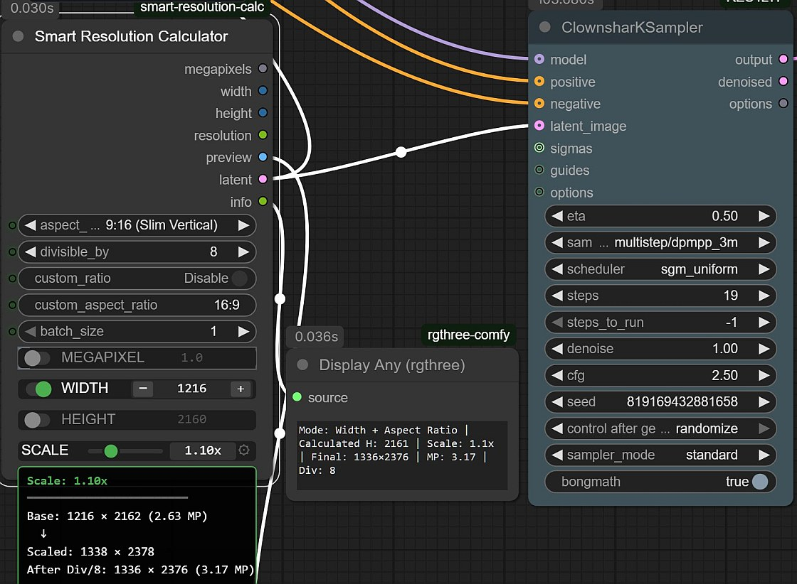

# ComfyUI Smart Resolution Calculator

[](https://www.python.org/downloads/)
[](https://registry.comfy.org/publishers/djdarcy/nodes/comfyui-smart-resolution-calc)
[](https://github.com/djdarcy/ComfyUI-Smart-Resolution-Calc/releases)
[](https://opensource.org/licenses/MIT)

Flexible resolution and latent generation for [ComfyUI](https://github.com/comfyanonymous/ComfyUI) with compact custom widgets. Specify any combination of dimensions and aspect ratio - the node calculates missing values automatically.

## Overview

Smart Resolution Calculator brings intuitive dimension control to ComfyUI workflows. Instead of manually calculating widths from heights or dimensions from megapixels, simply enable the values you know and let the node compute the rest. Compact rgthree-style widgets keep your workflow clean while providing powerful calculation modes.



*Example workflow showing the Smart Resolution Calculator with disabled "image "input (AR Only mode), custom aspect ratio 5.225:2.25, HEIGHT enabled at 1200, SCALE at 1.25x, calculating width and outputting 3488×1504 available through the latent to be sent to KSampler.*

## Features

- **Image dimension extraction** - Connect images to auto-extract aspect ratio or exact dimensions ([detailed guide](docs/image-input.md))
- **IMAGE output with transform modes** - Generate or transform images with 4 distinct strategies:
  - **transform (distort)**: Scale to exact dimensions (stretch/squash to fit)
  - **transform (crop/pad)**: Pure crop/pad at original 1:1 scale (no scaling)
  - **transform (scale/crop)**: Scale to cover target, crop excess (maintains aspect ratio)
  - **transform (scale/pad)**: Scale to fit inside target, pad remainder (maintains aspect ratio)
- **Empty image generation** - Create images with 5 fill patterns (black, white, custom color, noise, random)
- **Interactive tooltips** - Hover over widget labels for quick help, extended explanations, and links to documentation
- **One-click resolution setup** - Toggle dimensions you want, node calculates the rest
- **5 calculation modes** - Width+Height, Width+AR, Height+AR, Megapixels+AR, or defaults
- **Scale multiplier** - Scale dimensions up/down (0-7x) with custom widget and real-time preview
- **Compact custom widgets** - rgthree-style controls with inline toggles
- **Values preserved when toggled off** - Change your mind without losing settings
- **Direct latent output** - No separate Empty Latent Image node needed
- **23 preset aspect ratios** - From 1:1 to 32:9, plus custom ratio support
- **Visual preview** - See exact dimensions and aspect ratio before generation
- **Divisibility control** - Ensures compatibility with SD/Flux models (8/16/32/64)
- **Workflow persistence** - Widget states save/load with workflows

## Prerequisites

- ComfyUI installation
- Python 3.10+ (or ComfyUI's embedded Python)
- No additional dependencies (uses ComfyUI's PyTorch, PIL, numpy)

## Installation

### ComfyUI Registry (Recommended)

The easiest way to install is through the ComfyUI Registry:

1. Open **ComfyUI Manager** in your ComfyUI interface
2. Search for **"Smart Resolution Calculator"** or **"djdarcy"**
3. Click **Install** and restart ComfyUI

The node will appear under: **Smart Resolution → Smart Resolution Calculator**

Alternatively, use the command line:
```bash
comfy node install comfyui-smart-resolution-calc
```

### Git Clone

```bash
cd ComfyUI/custom_nodes
git clone https://github.com/djdarcy/ComfyUI-Smart-Resolution-Calc.git
```

Then restart ComfyUI or use **Manager → Refresh Node Definitions**.

### Manual Installation

1. Download the [latest release](https://github.com/djdarcy/ComfyUI-Smart-Resolution-Calc/releases) and extract to `ComfyUI/custom_nodes/ComfyUI-Smart-Resolution-Calc/`
2. Restart ComfyUI
3. Find the node in: **Smart Resolution → Smart Resolution Calculator**

## Usage

### Basic Workflow

1. Add **Smart Resolution Calculator** to your workflow
2. Select an aspect ratio (default: 3:4 Golden Ratio)
3. **Enable the dimensions you know/want** by clicking toggle switches
4. The node automatically calculates missing values
5. Check the **info** output to verify the calculation mode
6. Connect **latent** output to your KSampler

### Calculation Modes

#### Mode 1: Height + Aspect Ratio (Typical Designer Workflow)
Perfect when you know the exact height you want:

- **Enable**: HEIGHT toggle
- **Set**: height to 1920
- **Select**: aspect ratio 4:3
- **Result**: Width automatically calculated as 1536
- **Info**: `Mode: Height + Aspect Ratio | Calculated Width: 1536 | MP: 2.95 | Div: 16`

#### Mode 2: Width + Aspect Ratio
When you know the width but not the height:

- **Enable**: WIDTH toggle
- **Set**: width to 1920
- **Select**: aspect ratio 16:9
- **Result**: Height automatically calculated as 1080
- **Info**: `Mode: Width + Aspect Ratio | Calculated Height: 1080 | MP: 2.07 | Div: 16`

#### Mode 3: Megapixels + Aspect Ratio
Original Flux Resolution Calc behavior:

- **Enable**: MEGAPIXEL toggle
- **Set**: megapixels to 1.0
- **Select**: aspect ratio 16:9
- **Result**: Both width and height calculated
- **Info**: `Mode: Megapixels + Aspect Ratio | Calculated W: 1216 × H: 688 | Div: 16`

#### Mode 4: Both Dimensions
Override aspect ratio with exact dimensions:

- **Enable**: Both WIDTH and HEIGHT toggles
- **Set**: width 1920, height 1080
- **Result**: Megapixels calculated, actual ratio may differ
- **Info**: `Mode: Width + Height | Calculated MP: 2.07 | Div: 16`

#### Mode 5: Default
No toggles active uses 1.0 MP with selected aspect ratio:

- **Result**: Default dimensions for selected ratio
- **Info**: `Mode: Default (1.0 MP) | W: 1216 × H: 688 | Div: 16`

### Image Input

Connect an IMAGE output to automatically extract dimensions or aspect ratio. See the [Image Input Guide](docs/image-input.md) for detailed documentation.

**Quick Start**:
- Connect image → Extraction modes automatically available
- **AR Only** (default): Extracts aspect ratio, uses with megapixel setting
- **Exact Dims**: Uses exact image dimensions with scale applied
- **Copy Button**: Extract once, then manually adjust

### Aspect Ratio Presets

* **Portrait** (11 ratios): 2:3, 3:4 (default), 3:5, 4:5, 5:7, 5:8, 7:9, 9:16, 9:19, 9:21, 9:32
* **Square** (1 ratio): 1:1
* **Landscape** (11 ratios): 3:2, 4:3, 5:3, 5:4, 7:5, 8:5, 9:7, 16:9, 19:9, 21:9, 32:9

**Custom Ratios**: Enable "custom_ratio" and enter any ratio (e.g., "5:3")

### Outputs

- `megapixels` (FLOAT) - Calculated or user-specified MP value
- `width` (INT) - Final width after divisibility rounding
- `height` (INT) - Final height after divisibility rounding
- `resolution` (STRING) - Formatted string (e.g., "1920 x 1080")
- `preview` (IMAGE) - Visual grid preview with dimensions and aspect ratio overlay
- `image` (IMAGE) - Generated or transformed image at calculated dimensions (4 transform modes + empty)
- `latent` (LATENT) - Ready-to-use latent tensor for sampling
- `info` (STRING) - Calculation mode and computed values

**Note**: `preview` is always a visualization grid, while `image` is the actual generated/transformed image output.

## How It Works

1. User enables dimension toggles (megapixels, width, or height)
2. Node checks which dimensions are active (priority order)
3. Calculates missing values using aspect ratio
4. Rounds to divisibility requirement (8/16/32/64)
5. Generates latent tensor `[batch_size, 4, height//8, width//8]`
6. Outputs dimensions, preview image, and latent

**Priority Order** (first match wins):
1. Width + Height → calculate megapixels
2. Width + Aspect Ratio → calculate height
3. Height + Aspect Ratio → calculate width
4. Megapixels + Aspect Ratio → calculate both
5. None active → default to 1.0 MP + aspect ratio

## Troubleshooting

### Common Issues

**Widget toggles don't affect calculation**
- Enable debug mode to verify data flow
- Ensure ComfyUI restarted after installation
- Check browser console for JavaScript errors

**Workflow doesn't save widget states**
- Verify browser console shows `configure called` logs
- Re-save workflow after toggling widgets
- Clear browser cache if issues persist

**Latent tensor errors**
- Update ComfyUI to latest version
- Check ComfyUI console for error details
- Verify PyTorch installation

### Debug Mode

Enable detailed logging for troubleshooting:

**Python Logging** (ComfyUI console):
```bash
# Windows
set COMFY_DEBUG_SMART_RES_CALC=true

# Linux/Mac
export COMFY_DEBUG_SMART_RES_CALC=true
```

**JavaScript Logging** (Browser console F12):
```javascript
// Standard debug logging
localStorage.setItem('DEBUG_SMART_RES_CALC', 'true');

// Verbose logging (includes coordinates, hit areas, detailed state)
localStorage.setItem('VERBOSE_SMART_RES_CALC', 'true');
```

Debug logs show widget data flow, calculation steps, and final results. Verbose mode adds detailed coordinate logging for tooltip positioning and widget layout debugging.

**Disable**:
```bash
set COMFY_DEBUG_SMART_RES_CALC=false
localStorage.removeItem('DEBUG_SMART_RES_CALC');
localStorage.removeItem('VERBOSE_SMART_RES_CALC');
```

## Documentation

- **[CHANGELOG.md](CHANGELOG.md)** - Version history and release notes
- **[Image Input Guide](docs/image-input.md)** - Detailed documentation for image dimension extraction feature
- **[CONTRIBUTING.md](CONTRIBUTING.md)** - Development setup and contribution guidelines

## Contributing

Contributions welcome! Please:

1. Fork the repository
2. Create a feature branch
3. Test changes in ComfyUI (see CONTRIBUTING.md for debug setup)
4. Submit a pull request

See [CONTRIBUTING.md](CONTRIBUTING.md) for detailed guidelines including VSCode debugging setup.

Like the project?

[](https://www.buymeacoffee.com/djdarcy)

### Development Setup

```bash
git clone https://github.com/djdarcy/ComfyUI-Smart-Resolution-Calc.git
cd ComfyUI-Smart-Resolution-Calc
# Copy to ComfyUI custom_nodes and restart ComfyUI
```

For VSCode debugging with ComfyUI, see the "VSCode Debugging" section in CONTRIBUTING.md.

## Technical Details

### Divisibility Rounding

Ensures dimensions work with model latent space:
- **8**: Minimum (latent space 8x downsampled)
- **16**: Safer for most models
- **32**: Recommended
- **64**: Maximum compatibility (default)

Rounding applied separately to width and height.

### Latent Format

Compatible with Stable Diffusion and Flux:
- Format: `[batch_size, 4, height // 8, width // 8]`
- 4-channel latent space
- Auto-placed on appropriate device (CPU/GPU)

### Architecture

Custom JavaScript widgets with compact 24px height design:

- Widgets declared in `INPUT_TYPES["hidden"]` for data flow
- `serialize_widgets = true` enables workflow persistence
- Data structure: `{on: boolean, value: number}`

**NOTE**: ComfyUI requires both `INPUT_TYPES["hidden"]` declarations AND `serialize_widgets = true` for proper widget data flow. One alone is insufficient.

## Acknowledgments

- [controlaltai-nodes](https://github.com/gseth/ControlAltAI-Nodes) - Flux Resolution Calc inspiration
- [rgthree-comfy](https://github.com/rgthree/rgthree-comfy) - Power Lora Loader compact widget design
- [ComfyUI](https://github.com/comfyanonymous/ComfyUI) - The amazing UI framework
- ComfyUI community - Testing and feedback

## Development

For contributors: This project uses Git-RepoKit hooks for automatic version tracking. Run `./scripts/install-hooks.sh` to set up versioning hooks.

## License

Smart Resolution Calculator, Copyright (C) 2025 Dustin Darcy

This project is licensed under the MIT License - see the [LICENSE](LICENSE) file for details.
